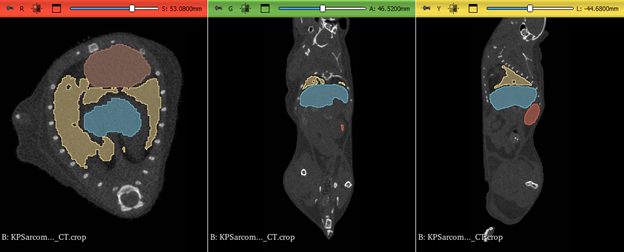
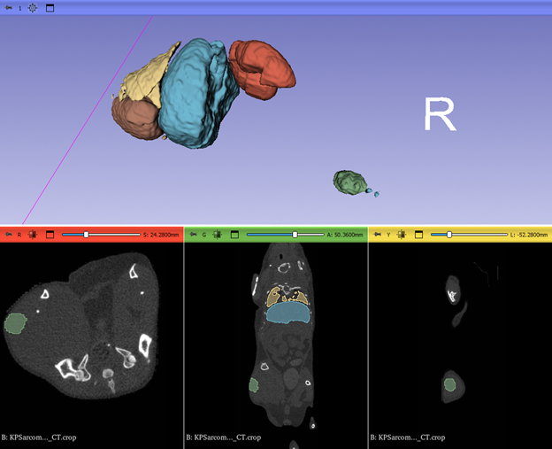

# AI Segmentation Analysis Using 3D Slicer

## Overview

This project demonstrates a workflow for evaluating AI-generated medical image segmentations using 3D Slicer. A CT dataset containing several anatomical structures was loaded and AI-generated segmentation masks were visualized and analyzed.

The segmented structures include:

- Tumor
- Lung
- Heart
- Liver
- Kidney

## Dataset

The dataset consists of a cropped CT scan stored in NIfTI format along with segmentation masks generated by a machine learning model.

## Workflow

1. Load CT dataset into 3D Slicer
2. Import segmentation masks
3. Convert labelmaps into segmentation objects
4. Visualize segmentations in multiplanar slice views
5. Compute quantitative statistics using the Segment Statistics module

## Visualization

Example of segmentation overlays in orthogonal CT slices.

## Visualization

Example of segmentation overlays in orthogonal CT slices.

### Tumor Segmentation

## Quantitative Results

Segment statistics were computed using the Segment Statistics module.

## Discussion

The segmentation results demonstrate that AI-generated anatomical masks can be imported and analyzed within the 3D Slicer environment. Volume measurements provide  insight into predicted structures and can be used for downstream analysis.

